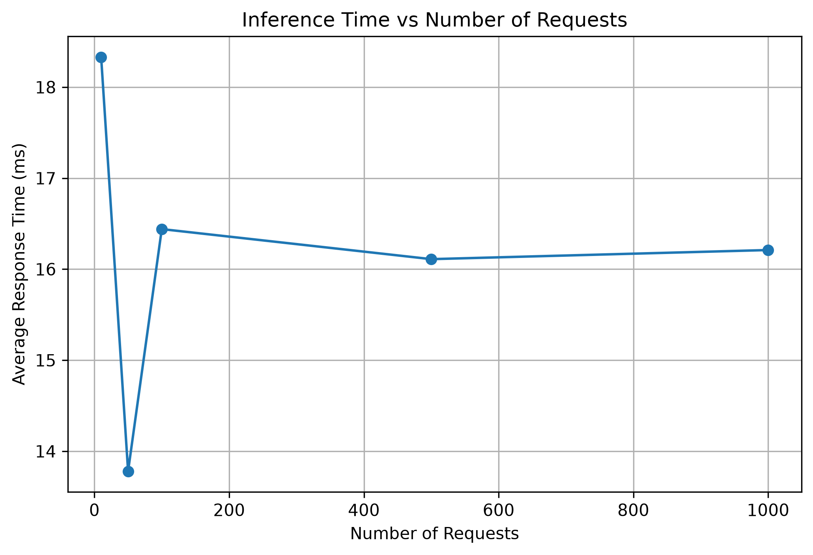
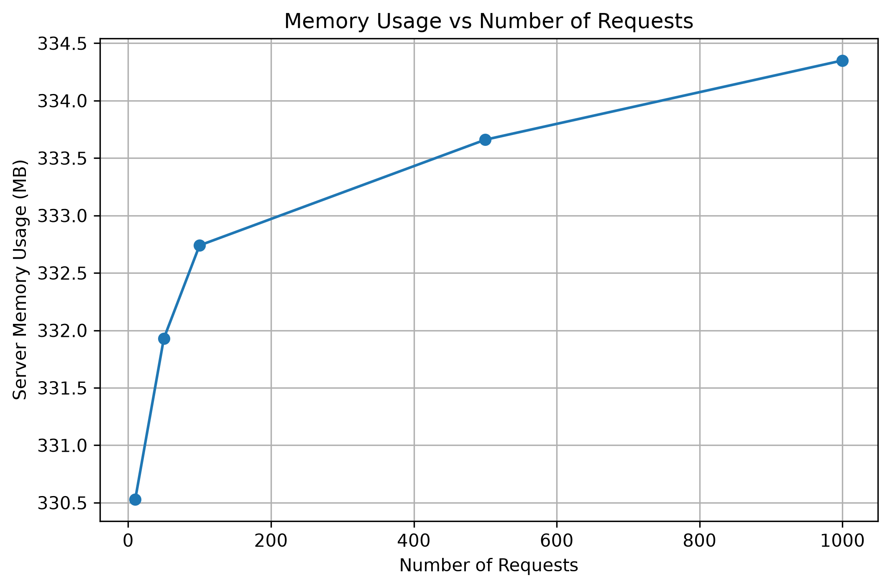

# Real-Time Fraud Detection System

## Overview

This project implements a real-time credit card fraud detection system using Machine Learning and FastAPI.

The system uses an XGBoost classification model to predict whether a transaction is **fraudulent or genuine** and provides the prediction through a RESTful API.

## Features

- XGBoost-based fraud detection
- Real-time prediction through REST API
- FastAPI deployment
- Fraud probability prediction
- Inference time evaluation
- Server memory usage evaluation
- Load testing under different request loads
- Performance visualization using graphs

## Technologies Used

- Python
- XGBoost
- Scikit-learn
- Pandas
- NumPy
- FastAPI
- Uvicorn
- Joblib
- Psutil
- Matplotlib

## Dataset

The project uses a credit card fraud dataset containing **10,000 transactions**.

- Genuine transactions: **9,849**
- Fraudulent transactions: **151**

## Machine Learning Model

An **XGBoost classification model** is used for fraud detection.

The trained preprocessing pipeline and XGBoost model are saved as:

```text
credit_card_fraud_xgboost.pkl
```

The complete pipeline is loaded by the FastAPI application for real-time prediction.

## Model Performance

The trained XGBoost model achieved the following results:

| Metric | Score |
|---|---:|
| Accuracy | 99.95% |
| Precision | 100% |
| Recall | 96.67% |
| F1 Score | 98.31% |
| ROC-AUC | 1.00 |

These results indicate that the model performs effectively in distinguishing fraudulent transactions from genuine transactions.

## API

The model is deployed using **FastAPI**.

The API runs locally using Uvicorn:

```bash
uvicorn app:app
```

### GET /

Checks whether the API is running.

Example response:

```json
{
  "message": "Real-Time Fraud Detection API is running"
}
```

### POST /predict

Accepts transaction details and returns:

- Fraud/Genuine prediction
- Prediction value
- Fraud probability

### Example Request

```json
{
  "amount": 850.75,
  "transaction_hour": 2,
  "merchant_category": "Travel",
  "foreign_transaction": 1,
  "location_mismatch": 1,
  "device_trust_score": 25,
  "velocity_last_24h": 10,
  "cardholder_age": 35
}
```

### Example Response

```json
{
  "prediction": 1,
  "result": "Fraud",
  "fraud_probability": 0.9997
}
```

## API Documentation

FastAPI automatically provides interactive API documentation.

After starting the server, open:

```text
http://127.0.0.1:8000/docs
```

The `/docs` page can be used to test the `/predict` endpoint.

## Performance Evaluation

The FastAPI server was tested with different request loads to evaluate inference time, throughput, and server memory usage.

| Requests | Avg Response Time (ms) | Throughput (req/s) | Server Memory After (MB) |
|---:|---:|---:|---:|
| 10 | 18.33 | 54.57 | 330.53 |
| 50 | 13.78 | 72.57 | 331.93 |
| 100 | 16.44 | 60.84 | 332.74 |
| 500 | 16.11 | 62.06 | 333.66 |
| 1000 | 16.21 | 61.68 | 334.35 |

### Inference Time

The average response time remained approximately between **13.78 ms and 18.33 ms** across the tested loads.



### Memory Usage

The FastAPI server memory usage increased gradually from approximately **330.53 MB to 334.35 MB** during the tests.



## Performance Testing

The performance test is implemented in:

```text
performance_test.py
```

It sends requests to the `/predict` endpoint for different loads:

```text
10
50
100
500
1000
```

The test measures:

- Average response time
- Throughput
- Server memory usage

The results are saved in:

```text
performance_results.csv
```

## Project Structure

```text
Real-Time-Fraud-Detection-System/
│
├── app.py
├── create_graphs.py
├── performance_test.py
├── performance_results.csv
├── credit_card_fraud_xgboost.pkl
├── requirements.txt
├── README.md
│
└── graphs/
    ├── inference_time.png
    └── memory_usage.png
```

## Installation

Clone the repository:

```bash
git clone https://github.com/sayma2006/Real-Time-Fraud-Detection-System.git
```

Move into the project directory:

```bash
cd Real-Time-Fraud-Detection-System
```

Install the required dependencies:

```bash
pip install -r requirements.txt
```

## Running the API

Start the FastAPI server:

```bash
uvicorn app:app
```

The API will be available at:

```text
http://127.0.0.1:8000
```

Interactive documentation:

```text
http://127.0.0.1:8000/docs
```

## Running Performance Tests

Make sure the FastAPI server is running first.

Then open another terminal and run:

```bash
python performance_test.py
```

The performance results will be saved to:

```text
performance_results.csv
```

## Generating Performance Graphs

Run:

```bash
python create_graphs.py
```

The graphs will be generated inside the `graphs` folder.

## Conclusion

This project demonstrates the deployment of an XGBoost-based fraud detection model as a real-time REST API using FastAPI.

The system successfully performs fraud prediction and was evaluated under different request loads using inference time, throughput, and server memory usage measurements.
